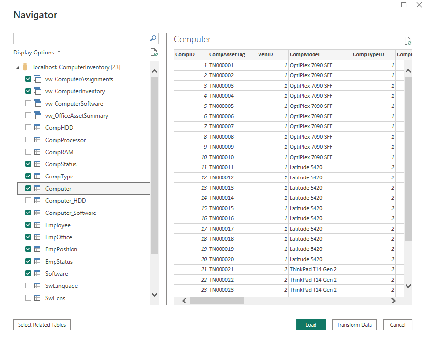
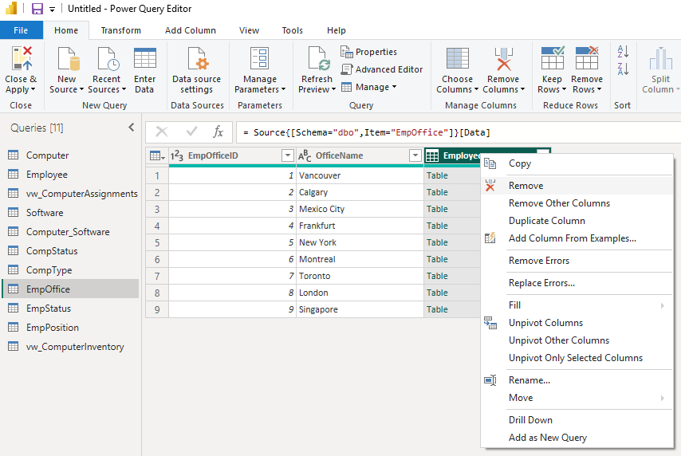

# Data Modelling

1. After completing connection configuration, click to the Navigator screen.
The connection configuration is documented in [Connection Details and Data Setup](../data-source/connection-details-and-data-setup.md). 

2. On the Navigator screen, select desired tables and views that will be used in the dashboards. Additional tables may be added later, if needed. Select `Transform Data`.

3. On the Query Editor screen, remove columns that have "Table" or "Value" values in the rows. Only columns with IDs or descriptive field names are to be kept.

4. Select Model view in Power BI Desktop, and validate or modify relationships. Remove unnecessary tables. In the example vW_* were removed since raw tables will be used. the extra view tables would have created confusing duplicate logic.

   
5. At this step, we can start creating reports in Report View.
