# Report Design

## Dashboard Overview

High-level navigation page for accessing different report sections.

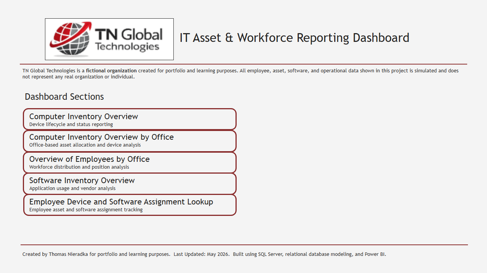

---

## 1. Computer Inventory Overview

Provides a summary of device inventory by status and type.

- Shows total devices and distribution by status
- Highlights proportion of active vs inactive devices

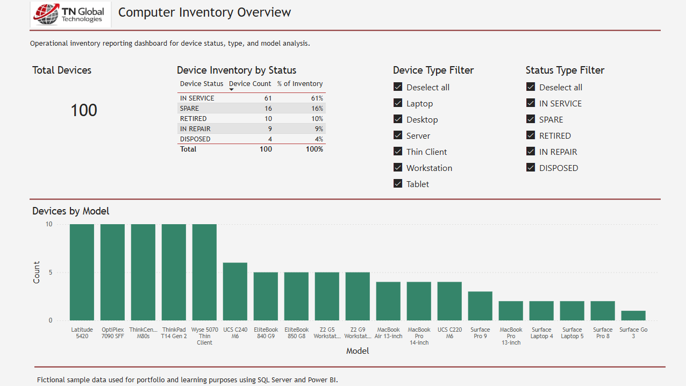

### Filtered Example

When device types and status are filtered...
- Counts and Device models are shown.
- Interactive filtering is demonstrated.
- Focused analysis of specific device categories is made possible.
  
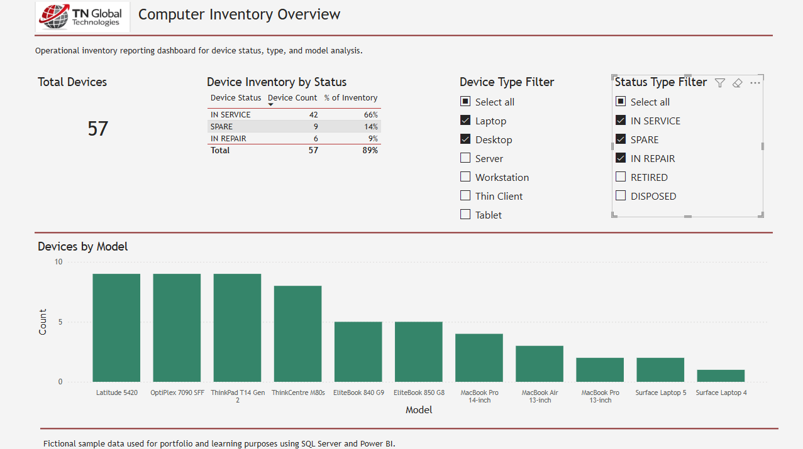

---

## 2. Computer Inventory by Office

Displays device distribution across office locations.

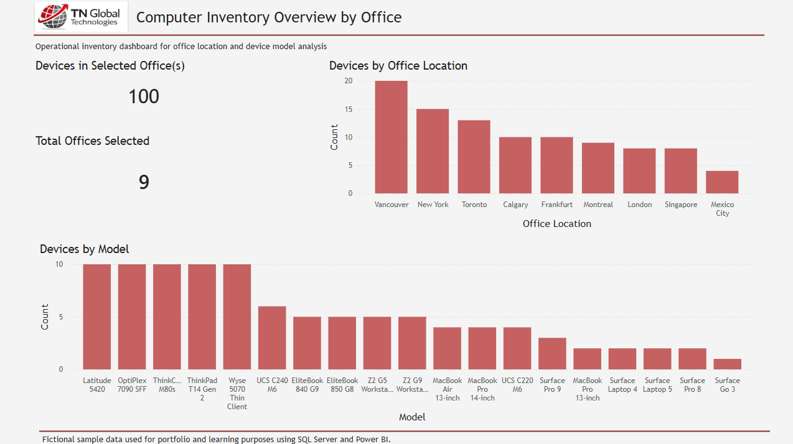

### Filtered Example

When a specific office or offices are selected...
- Differences in device allocation are shown.

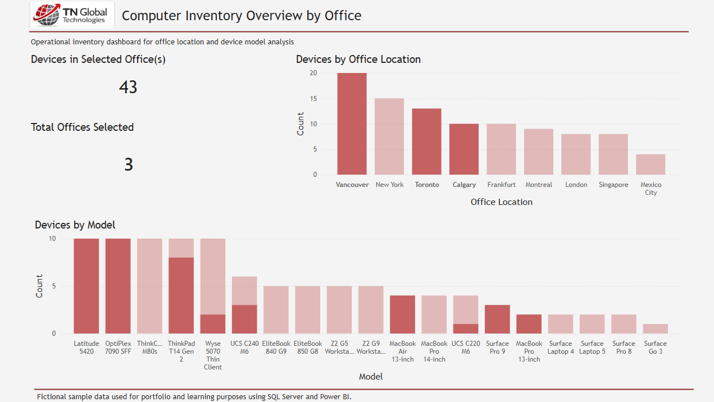

---

## 3. Employee Overview

Workforce distribution and job role analysis.

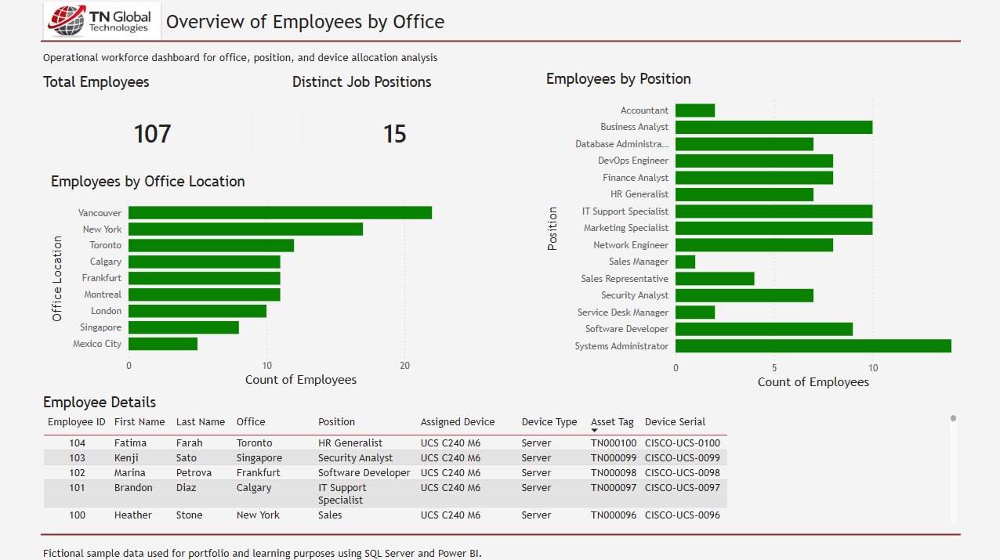

### Filtered Example

When a specific office or offices are selected...
- The role distribution at that office is displayed.
- The employees, their roles, and other details are filtered.

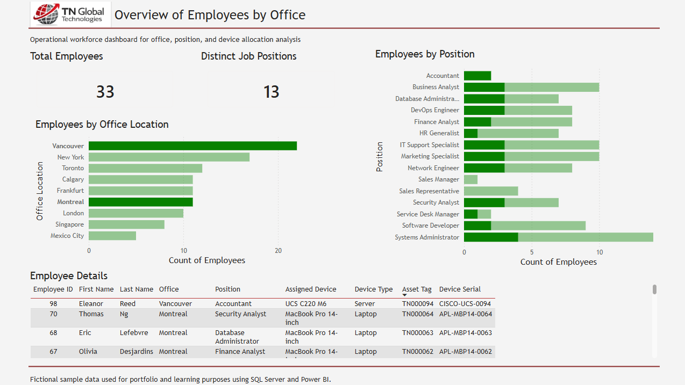

---

## 4. Software Inventory Overview

Analysis of software installations and vendor distribution.

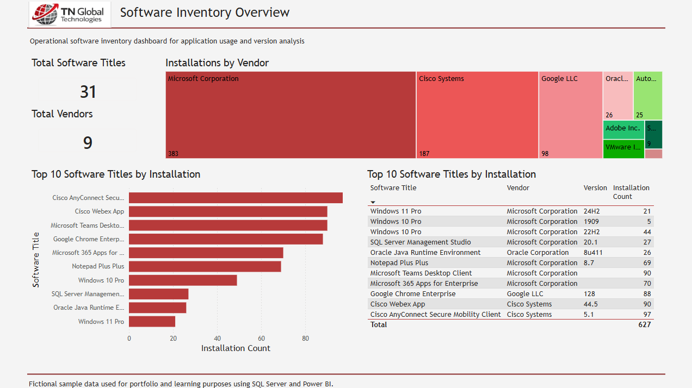

### Filtered Example

When specific vendor is selected in the treemap...
- Vendor-specific software is shown.
- Installation count is displayed.
  
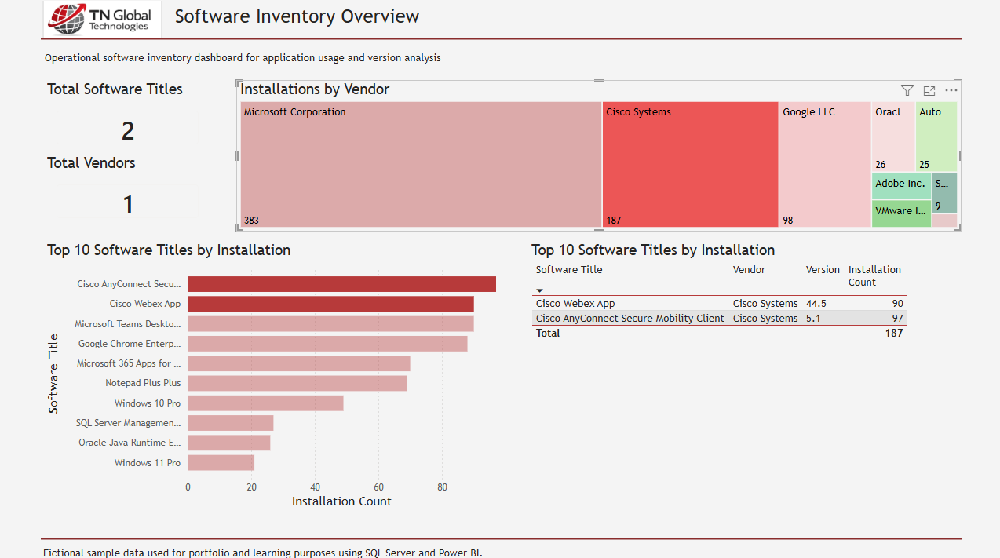

---

## 5. Employee Device & Software Lookup

Detailed lookup for employee device and software assignments.

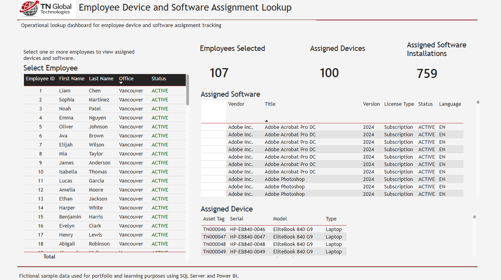

### Filtered Example

When specific employee(s) is selected in the table, their assigned software and devices are shown.

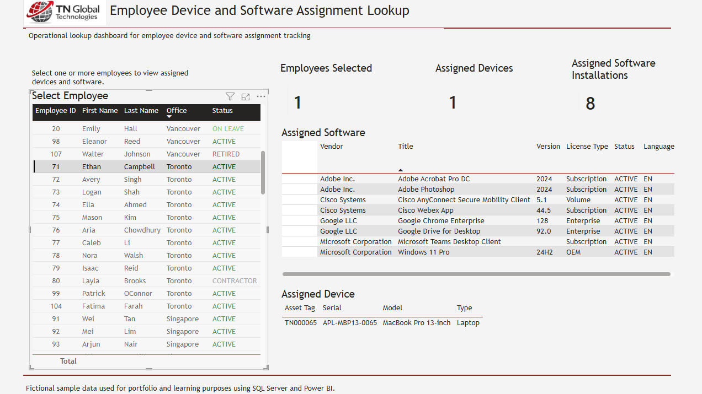

